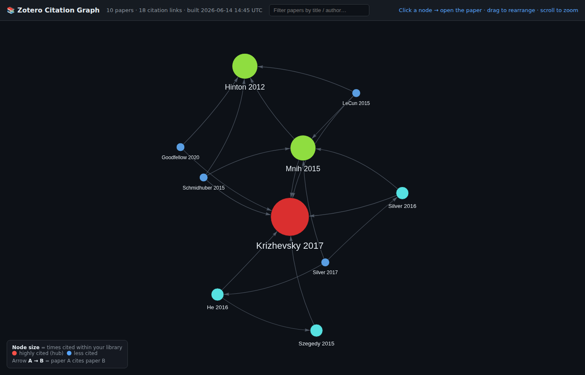

# Zotero Citation Graph

Turn a Zotero literature-review export into an **interactive citation graph**:

- every **node** is a paper,
- a directed **edge A → B** means *paper A cites paper B*,
- node **size/colour** scales with how often a paper is cited *within your library*,
- **clicking a node opens that paper's website** (its DOI page / URL),
- it's a single self-contained HTML file — **double-click `index.html`**, no server.



## Quick start

```bash
# 1. (demo) generate the bundled sample library + cached citation data
python3 sample/make_sample.py

# 2. build the graph
python3 build_graph.py --input sample/library.json --out out

# 3. open the viewer
#    file://<this-dir>/index.html   (or: ./refresh.sh prints the link)
```

## Use your own library

1. In Zotero: select your collection → right-click → **Export Collection** →
   format **CSL JSON** (or **BibTeX**). Save it, e.g. `My Library.json`.
2. Rebuild and refresh:

   ```bash
   # offline: rebuild from whatever citations are already cached
   ./refresh.sh "My Library.json"

   # online: also fetch NEW citation links from CrossRef (needs DOIs + network)
   ONLINE=1 MAILTO=you@uni.edu ./refresh.sh "My Library.json"
   ```

   Re-run "every now and then" after you add papers — citation lookups are
   cached under `cache/`, so refreshes are incremental.

## How citation edges are found

Zotero exports do **not** contain a citation graph. For each paper that has a
**DOI**, `build_graph.py` looks up its reference list from
[CrossRef](https://www.crossref.org/) and draws an edge to every referenced
paper that is *also in your library*. Responses are cached, so the graph can be
rebuilt fully offline. Papers without a DOI still appear as nodes (just without
auto-discovered citations).

## Files

| Path | What |
|------|------|
| `build_graph.py` | pipeline: Zotero export → `out/graph-data.js` + `out/graph.json` |
| `index.html` | the interactive viewer (vis-network, vendored — offline) |
| `refresh.sh` | rebuild from an export (the "refresh every now and then" entry point) |
| `sample/` | sample CSL-JSON library + its generator |
| `cache/crossref/` | cached CrossRef reference lists (incremental, offline-friendly) |
| `vendor/` | vis-network bundle (no CDN needed) |

See `.claude/skills/run-zotero-citation-graph/SKILL.md` for the headless
build/screenshot harness.
